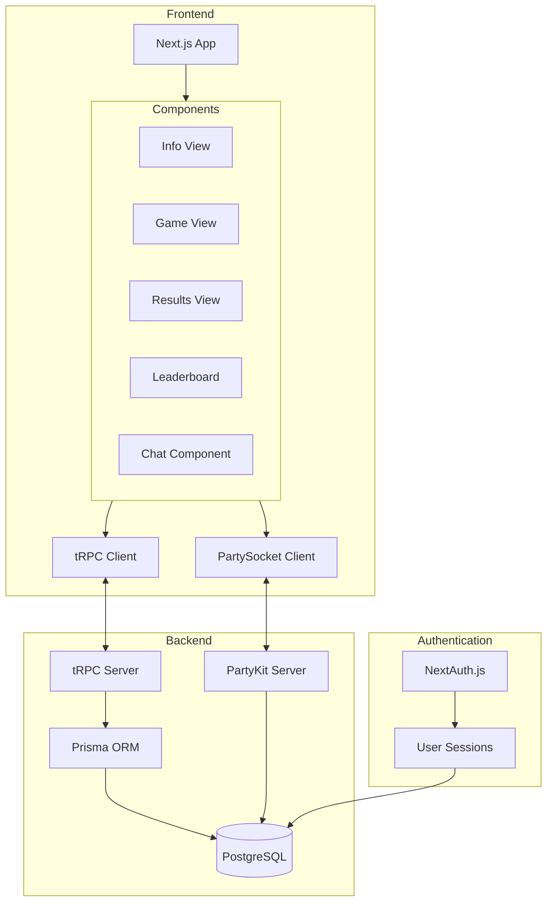
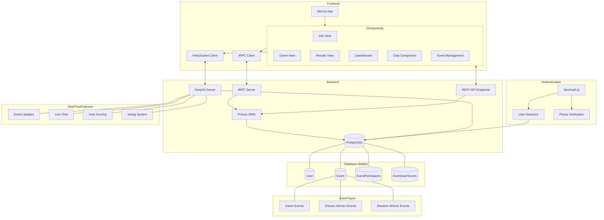

# Architecture

```mermaid
graph TB
    subgraph Frontend
        Next[Next.js App]
        Components[React Components]
        TRPCClient[tRPC Client]
        PartySocket[PartySocket Client]
        
        Next --> Components
        Components --> TRPCClient
        Components --> PartySocket
    end

    subgraph Backend
        TRPCServer[tRPC Server]
        PrismaORM[Prisma ORM]
        PartyKit[PartyKit Server]
        PostgreSQL[(PostgreSQL)]
        
        TRPCServer --> PrismaORM
        PrismaORM --> PostgreSQL
        PartyKit --> PostgreSQL
    end

    TRPCClient <--> TRPCServer
    PartySocket <--> PartyKit

    subgraph Components
        InfoView[Info View]
        GameView[Game View]
        ResultsView[Results View]
        Leaderboard[Leaderboard]
        Chat[Chat Component]
    end

    subgraph Authentication
        Auth[NextAuth.js]
        Sessions[User Sessions]
        
        Auth --> Sessions
        Sessions --> PostgreSQL
    end
```

```mermaid
graph TB
    subgraph Frontend
        Next[Next.js App]
        Components[React Components]
        TRPCClient[tRPC Client]
        PartySocket[PartySocket Client]
        
        Next --> Components
        Components --> TRPCClient
        Components --> PartySocket
    end

    subgraph Backend
        TRPCServer[tRPC Server]
        RestAPI[REST API Endpoints]
        PrismaORM[Prisma ORM]
        PartyKit[PartyKit Server]
        PostgreSQL[(PostgreSQL)]
        
        TRPCServer --> PrismaORM
        RestAPI --> PrismaORM
        PrismaORM --> PostgreSQL
        PartyKit --> PostgreSQL
    end

    TRPCClient <--> TRPCServer
    Components <--> RestAPI
    PartySocket <--> PartyKit

    subgraph Database Models
        Users[(User)]
        Events[(Event)]
        EventParticipants[(EventParticipants)]
        EventUserScores[(EventUserScores)]
        
        PostgreSQL --- Users
        PostgreSQL --- Events
        PostgreSQL --- EventParticipants
        PostgreSQL --- EventUserScores
    end

    subgraph Components
        InfoView[Info View]
        GameView[Game View]
        ResultsView[Results View]
        Leaderboard[Leaderboard]
        Chat[Chat Component]
        EventManagement[Event Management]
        
        Components --- InfoView
        Components --- GameView
        Components --- ResultsView
        Components --- Leaderboard
        Components --- Chat
        Components --- EventManagement
    end

    subgraph Authentication
        Auth[NextAuth.js]
        Sessions[User Sessions]
        PhoneVerification[Phone Verification]
        
        Auth --> Sessions
        Auth --> PhoneVerification
        Sessions --> PostgreSQL
    end

    subgraph RealTimeFeatures
        EventUpdates[Event Updates]
        LiveChat[Live Chat]
        UserScoring[User Scoring]
        Voting[Voting System]
        
        PartyKit --- EventUpdates
        PartyKit --- LiveChat
        PartyKit --- UserScoring
        PartyKit --- Voting
    end

    subgraph EventTypes
        GameEvents[Game Events]
        ChosenEvents[Chosen Winner Events]
        RandomEvents[Random Winner Events]
        
        Events --- GameEvents
        Events --- ChosenEvents
        Events --- RandomEvents
    end
```