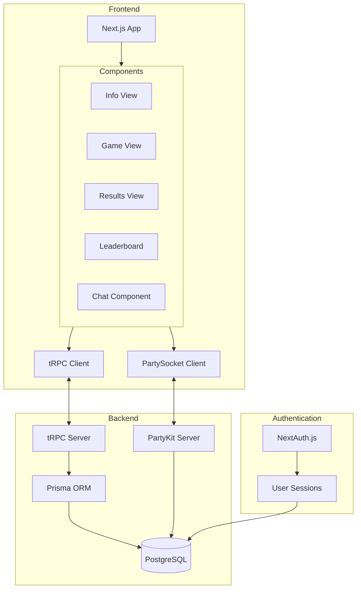

# Architecture

```mermaid
graph TB
    subgraph Frontend
        Next[Next.js App]
        Components[React Components]
        TRPCClient[tRPC Client]
        PartySocket[PartySocket Client]
        
        Next --> Components
        Components --> TRPCClient
        Components --> PartySocket
    end

    subgraph Backend
        TRPCServer[tRPC Server]
        PrismaORM[Prisma ORM]
        PartyKit[PartyKit Server]
        PostgreSQL[(PostgreSQL)]
        
        TRPCServer --> PrismaORM
        PrismaORM --> PostgreSQL
        PartyKit --> PostgreSQL
    end

    TRPCClient <--> TRPCServer
    PartySocket <--> PartyKit

    subgraph Components
        InfoView[Info View]
        GameView[Game View]
        ResultsView[Results View]
        Leaderboard[Leaderboard]
        Chat[Chat Component]
    end

    subgraph Authentication
        Auth[NextAuth.js]
        Sessions[User Sessions]
        
        Auth --> Sessions
        Sessions --> PostgreSQL
    end
```